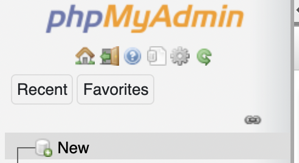
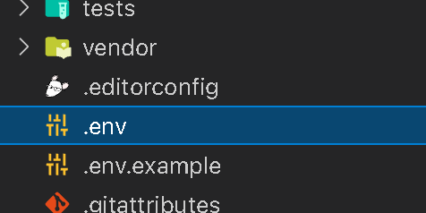
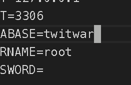
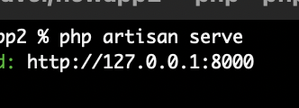

**Application Demo**

---

**How to run in your local file**

1. Install xampp(tested)
2. Install laravel
3. Run 'php artisan key:generate'
4. Run MySQL database with xampp
5. create database with the same name as your .env file\*
6. run 'php artisan serve'
7. go to link generated by your terminal\*\*

---

**\*How to create database file**

1. Go to 'localhost/phpmyadmin' or 127.0.0.1/phpmyadmin
2. click new 
3. create new database the same as your .env file  

---

\***\*Link generated by terminal**

